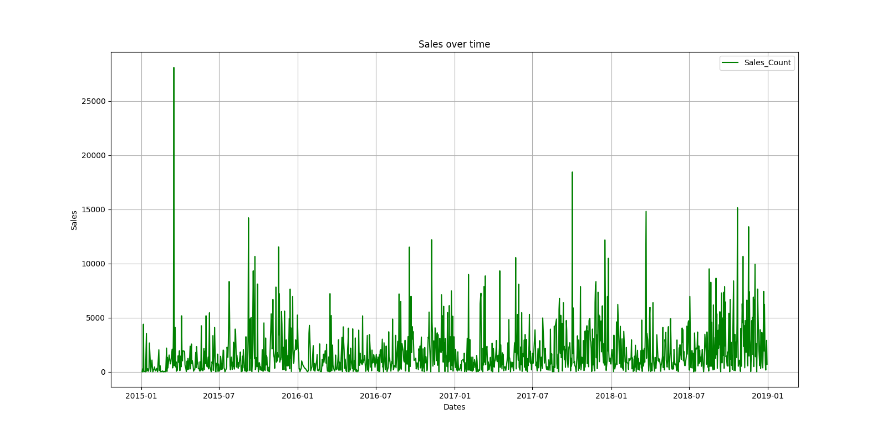

# Sales Forecasting Using XGBoost (Lag-Based Regression)

## Overview

This project implements a **sales forecasting pipeline using a supervised learning approach**.  
Daily sales data is transformed into a regression dataset using **lagged historical sales values**, and an **XGBoost regressor** is trained to predict future sales.

## Dataset Requirements

The input file `train.csv` must contain the following columns:

- **Order Date** — Date of the order (format: `DD/MM/YYYY`)
- **Sales** — Numerical sales value

Multiple orders per day are allowed and will be aggregated.

## Workflow

### 1. Data Loading and Preprocessing

- Load the dataset using `pandas`
- Convert `Order Date` from string to datetime format
- Aggregate total sales **per day** to form a univariate daily time series

### 2. Exploratory Visualization

A line plot of daily total sales is generated to:

- Observe trends and variability
- Identify anomalies or abrupt changes

This visualization is **descriptive only** and does not influence model training.

### 3. Feature Engineering (Lagged Variables)

The time series is converted into a supervised learning dataset by creating lag features:

| Feature | Description |
|------|------------|
| lag_1 | Sales at time *t − 1* |
| lag_2 | Sales at time *t − 2* |
| lag_3 | Sales at time *t − 3* |
| lag_4 | Sales at time *t − 4* |
| lag_5 | Sales at time *t − 5* |

**Target variable:**  
Sales at time *t*

Rows containing missing values introduced by lagging are removed.

### 4. Train–Test Split

- 80% of data is used for training
- 20% is reserved for testing
- `shuffle=False` preserves temporal order to prevent data leakage

This setup simulates real-world forecasting where future data is unseen.

### 5. Model Description

The model used is an **XGBoost Regressor**, configured with:

- Objective: Squared error regression
- Number of trees: 100
- Learning rate: 0.1
- Maximum tree depth: 5

XGBoost builds an ensemble of decision trees sequentially, where each new tree learns to correct the residual errors of the previous ensemble.

### 6. Prediction and Evaluation

- Predictions are generated for the test dataset
- Model performance is evaluated using **Root Mean Squared Error (RMSE)**
- A line plot compares **actual vs predicted sales** for visual assessment

## Assumptions

This modeling approach assumes:

- Sales exhibit short-term autocorrelation
- Recent sales values are informative for near-future prediction
- No major structural changes occur in the data
- External factors (holidays, promotions, events) are negligible

These assumptions are **not validated** within the code.

## Limitations

This model does **not**:

- Model seasonality or long-term trends
- Use calendar or holiday features
- Incorporate external explanatory variables
- Adapt to sudden demand shifts
- Perform multi-step forecasting robustly

## Suitable Use Cases

- Short-term forecasting
- Stable sales environments
- Low-volatility demand patterns
- Baseline forecasting comparisons

## Failure Scenarios

- Sudden promotions or demand spikes
- Seasonal sales patterns
- Long-term trend extrapolation
- Regime changes in customer behavior

## Dependencies

- Python 3.x
- pandas
- matplotlib
- numpy
- scikit-learn
- xgboost

## Key Takeaway

This project demonstrates how **machine learning can approximate short-term sales behavior using lagged historical patterns**, but it does **not model time explicitly**.

For problems involving seasonality, long-term trends, or external drivers, a different modeling approach is required.

---
